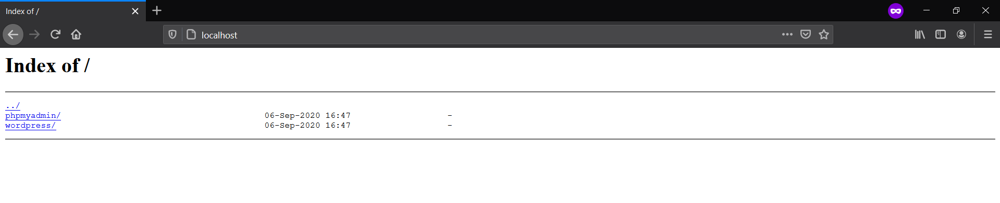
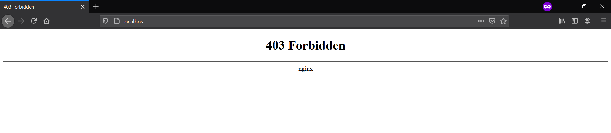
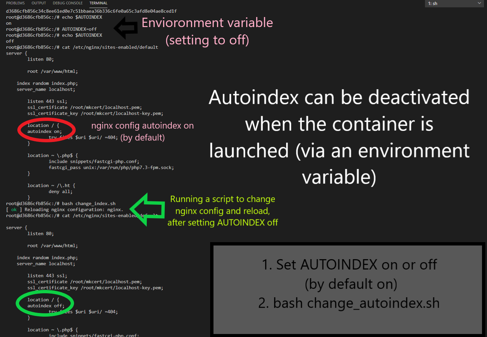
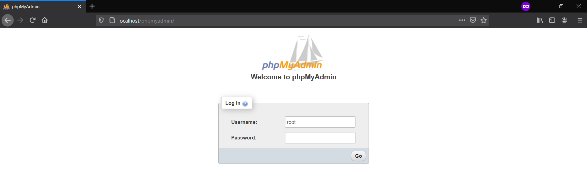

# ft_server


## Table of Contents:

1. [What is ft_server](#what-is-ft_server) ❔
    * [Description for newbies](#description-for-newbies) 💡
2. [Instructions](#Instructions) 👈
    * [Installation](#installation) 🔧
    * [Content](#content) 📦
    * [Build Docker image](#build-docker-image) 🐳
    * [Run a container](#run-a-container) 🐳
    * [Shell acces to the container](#shell-acces-to-the-container) 🐳
    * [Autoindex on/off](#autoindex-on/off) 📂
3. [Guide: What I did step by step](#Guide) ✔️
    * [Wiki]()
4. [How it looks](#how-it-looks) 💻 
4. [Resources/Research](#resources/research) 🔍

# What is ft_server ❔

> [SUBJECT](en.subject.pdf)

The goal of ft_server is to create a web server with ```Nginx``` capable of running a ```WordPress``` website, ```phpMyAdmin```, and a ```MySQL``` database. This server will run in only one Docker container, under Debian Buster.

|Services    |Path|
|:----------:|:-------:|
|WordPress   |```http:localhost/wordpress```|
|phpMyAdmin  |```http:localhost/phpmyadmin```|



## Description for newbies: 💡
When you type in the search bar "Google.com" a web server stores the files constituting the website (images, etc.). To obtain the page, your browser makes a request for a web page to the server which then sends the files (if the server doesn't find the requested document, it returns a 404 response instead).

There are different types of web servers: static or dynamic. In our case, we will create a dynamic web server. 

From a software point of view, the components of a dynamic web server are:
* An OS (ex: Windows or Linux)
* An HTTP server = software that supports client-server requests for the HTTP protocol (ex: Apache or Nginx)
* A database (ex: mySQL, Oracle)
* A script language = allows to interpret customer requests and translate them into html (ex: PHP, Python, Java)
---------------
* Our OS = Debian Buster 
* Our HTTP server = Nginx
* Our Database = Maria DB. 
* Our scripting language = PHP. 
> Plus we will install and configure phpMyAdmin and WordPress

We are going to do all of this in a Docker container. Why in a Docker container? 🐳

⚠️ The problem: Often we end up with applications that have tons of dependencies: need magic to convert images, need a particular database, need nginx or apache etc. When working with a third-party web host it is a bit hell. The system administrator will have to install the correct versions on a number of machines etc., puzzle. 💢

💯 The solution: Docker makes it possible to package an application in a virtual container. It's a sort of box that is completely isolated from our operating system. In which we can install all the libraries that our application needs to function. And we also install our application there. And so we can send this box all over the place, and it's going to work no matter what operating system.✔️

The Docker image would include:
* Nginx
* PHP 
* MariaDB SQL database
* PhpMyAdmin
* Wordpress
------------------

# Instructions 👈
### 🔧 Installation 
```
git clone https://github.com/vvarodi/ft_server.git && cd ft_server
```
### 📦 Content  
* ```Dockerfile``` (contains the instructions for building the webserver's docker image)

* ```srcs/``` (contains configs and some bash scripts)

* ```testing.sh``` (Build, run and enter a container)

* ```deleting.sh``` (Remove and clean)

```autoindex_on/off.sh``` (Once the container is running, stop and change AUTOINDEX environment variable)

### 🔨 Build Docker image
```
docker build -t ft_server .
```
### 🏃 Run a container
```
docker run --name ft_server -d -p 443:443 -p 80:80 ft_server
```
### 🐚 Shell acces to the container
```
docker exec -it ft_server bash
```
### 📁 Autoindex on/off
By default AUTOINDEX is on when you run the container. If you want to run the container setting autoindex off at the beggining of being launched:
```
docker run --env AUTOINDEX=off --name ft_server -d -p 443:443 -p 80:80 ft_server
```
It also can be activated/desactivated when the container is launched [(via an environment variable)](img/change_autoindex.png):

Inside the container
```
echo $AUTOINDEX
AUTOINDEX=off
bash change_autoindex.sh
```
or
```
sh autoindex_off.sh
```
-----------------------
# Guide: What I did step by step
## Docker basics command
```
# Build a docker image from a Dockerfile
docker build -t <your image name> <your Dockerfile dir>

# Start an instance of a docker image
docker run -it <your image name>

# Really important if you want to bind some ports on the container to your own computer, use -p option.
# Example for an Apache image first 80 means is local port, second 80 means container port
docker run -it debian:apache -p 80:80

# Enter running container
docker exec -it <ID or container name> bash

# See all images
docker images

# Remove images
docker rmi <image>
# docker rmi $(docker images -aq)

# Remove a container
$ docker rm <ID or container name>

# See running containers
docker ps
# List all docker containers (running and stopped).
docker ps -a

# Stop a container
docker kill <ID or container name>

# Delete all unused Docker images and cache and free space
docker system prune
```

## Guide

### Step 1: Nginx installed to serve your content.

 ```
 /etc/nginx/sites-available/* Extra virtual host configuration files
 /etc/nginx/sites-enabled/* Symlink to sites-available/<file> to enable vhost
 ```


### Step 2: Installed PHP for Processing && Configuring Nginx to Use the PHP Processor


### Step 3: MySQL installed to store and manage your data. 
MariaDB (database system) installed to store and manage data for your site, some Linux distributions (including Debian) use MariaDB as a drop-in replacement for MySQL
[Installation](https://www.digitalocean.com/community/tutorials/how-to-install-linux-nginx-mariadb-php-lemp-stack-on-debian-10#step-2-%E2%80%94-installing-mariadb) --> [code](img/mariadb.png)
```
+--------------------+
f Database           f
+--------------------+
f information_schema f
f mysql              f
f new_database       f
f performance_schema f
+--------------------+
4 rows in set (0.000 sec)
```
### Step 4: phpMyAdmin installed to handle the administration of MySQL over the Web.


Checking connection between MySQL and phpMyAdmin: Testing Database Connection from PHP [code](img/display_db_table.php)


### Step 5: WordPress. Installation and Connection to wordpress database


Checking connection between MySQL/phpMyAdmin with WordPress: wordpress database


Exporting database and Connecting my database to wordpress. This way I see the page when going to ```http://localhost/wordpress``` and not wordpress config

```http://localhost/wordpress/wp-admin``` to modify

(Not at final version) [Commit](https://github.com/vvarodi/ft_server/tree/81676fb35a22d645eb20199602fa9ab329d86670)


## Autoindex
  * [Autoindex-error](https://serverfault.com/questions/940276/force-nginx-to-always-autoindex-and-ignore-index-html-files)
  * [autoindex off-error 403](https://stackoverflow.com/questions/10663248/how-to-configure-nginx-to-enable-kinda-file-browser-mode)
"Without autoindex option you should be getting Error 403 for requests that end with / on directories that do not have an index.html file. With autoindex on you should be getting a simple listing"

**Autoindex ON**


**Autoindex OFF**

By ARG: [Commit](https://github.com/vvarodi/ft_server/tree/756d9cecf110508a6938c650a2d0ded56b7be09c)
``` 
docker build -t ft_server . --build-arg autoindex=off
```
By ENV: 
```
docker run --env AUTOINDEX=off --name ft_server -d -p 443:443 -p 80:80 ft_server
```

```server_tokens off;``` Config to not show nginx version

Verifying if the server is running with an autoindex which can be desactivated when the container is launched (via an environment variable)



## Handle errors:

If your page is not loading or throwing an error. Inspect:
``` 
cat /var/log/nginx/access.log
cat /var/log/nginx/error.log
```
To see all running services:

```
service --status-all 
```


# How it looks 👀
``` http://localhost/ ```


``` http://localhost/pypmyadmin```



``` http://localhost/wordpress```


## Resources/Research: 🔍
* **Docker**
  * [Get started with Docker](https://docs.docker.com/get-started/)
  * [Docker curriculum](https://docker-curriculum.com/)
  * [The Docker Handbook](https://www.freecodecamp.org/news/the-docker-handbook/)

* **Dockerfile:** a text file that contains all commands, in order, needed to build a given image.
  * [Dockerfile-best-practice](https://docs.docker.com/develop/develop-images/dockerfile_best-practices/)
  * [Dockerfile-reference](https://docs.docker.com/engine/reference/builder/)
  * [ARG-ENV](https://vsupalov.com/docker-arg-env-variable-guide/) Build-time configuration with ARG && Run-time Environment Replacement using ENV 

* **Web Server:** a web server stores and delivers the content for a website – such as text, images, video, and application data – to clients that request it.
  * [What is a web server?](https://developer.mozilla.org/en-US/docs/Learn/Common_questions/What_is_a_web_server#:~:text=A%20static%20web%20server%2C%20or,application%20server%20and%20a%20database.)
  * [Linux Web Server Guides](https://www.tecmint.com/linux-web-server-guides/amp/)
  * [How To Install Linux, Nginx, MariaDB, PHP (LEMP stack) on Debian 10](https://www.digitalocean.com/community/tutorials/how-to-install-linux-nginx-mariadb-php-lemp-stack-on-debian-10)
   LEMP stack means: Linux, Nginx, MySQL, PHP.

* **Debian**
  * [About Debian](https://www.debian.org/intro/about)
  * [Debian Directory Structure](https://wiki.debian.org/Nginx/DirectoryStructure)
  * [wget](https://www.gnu.org/software/wget/) use it to retrieve content and files from various web servers
  * [How to Use sed to Find and Replace String in Files](https://linuxize.com/post/how-to-use-sed-to-find-and-replace-string-in-files/) (autoindex on/off)

* **Nginx**
  * [Default nginx configuration](img/default)
  * [Nginx 502 Bad Gateway Error](https://ibcomputing.com/nginx-502-bad-gateway-error/)

* **MariaDB** (database system) installed to store and manage data for your site
  * [mysql_secure_installation](https://mariadb.com/kb/en/mysql_secure_installation/) a shell script available on Unix systems, and enables you to improve the security of your MariaDB installation
  * [MariaDB vs MySQL](https://www.guru99.com/mariadb-vs-mysql.html)
* **PHP**
  * [PHP Manual](https://www.php.net/manual/es/index.php)
* **phpMyAdmin** phpMyAdmin is a free software tool written in PHP, intended to handle the administration of MySQL over the Web.
  * [phpMyAdmin Documentation](https://docs.phpmyadmin.net/en/latest/)
  * [phpMyAdmin Configuration](https://docs.phpmyadmin.net/en/latest/config.html#)
  * [config.inc.php](https://docs.phpmyadmin.net/en/latest/config.html#config-examples)

* **WordPress**  
  * [How to install](https://wordpress.org/support/article/how-to-install-wordpress/)
  * [wp-config.php](https://wordpress.org/support/article/editing-wp-config-php/)

* **SSL**
  * [Types of ssl certificates](https://phoenixnap.com/kb/types-of-ssl-certificates)
  * [mkcert](https://github.com/FiloSottile/mkcert/)
  * [Creating a Self-Signed SSL Certificate](https://linuxize.com/post/creating-a-self-signed-ssl-certificate/)
  * [openssl tutorial](https://phoenixnap.com/kb/openssl-tutorial-ssl-certificates-private-keys-csrs)
  * [Testing Encryption](https://www.digitalocean.com/community/tutorials/how-to-create-a-self-signed-ssl-certificate-for-nginx-on-debian-10#step-5-%E2%80%94-testing-encryption)
  * [HTTPS for localhost](https://www.freecodecamp.org/news/how-to-get-https-working-on-your-local-development-environment-in-5-minutes-7af615770eec/)
